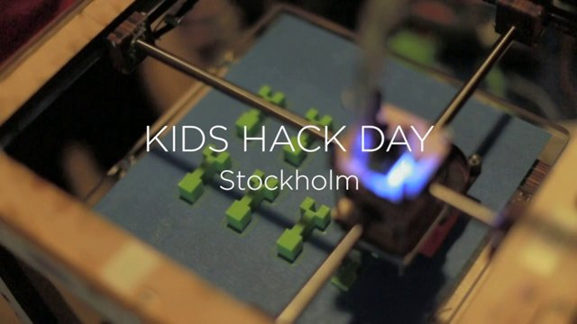
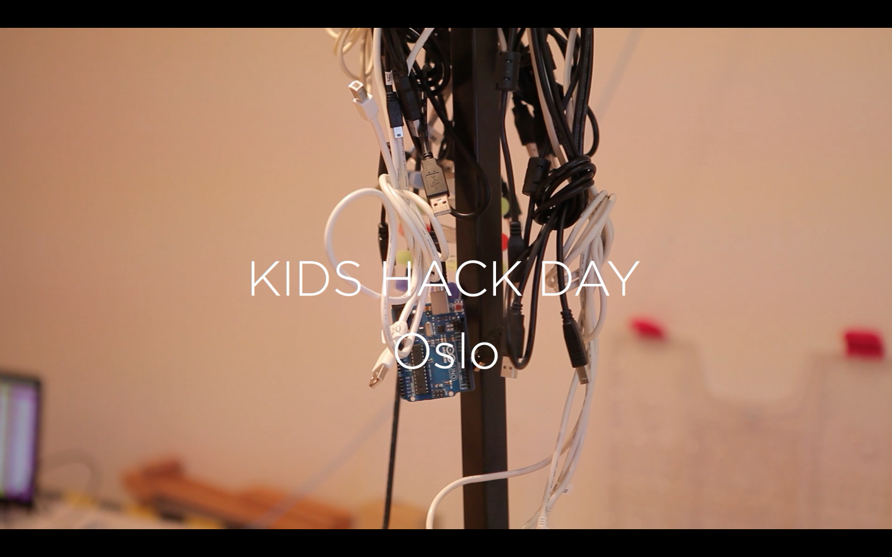
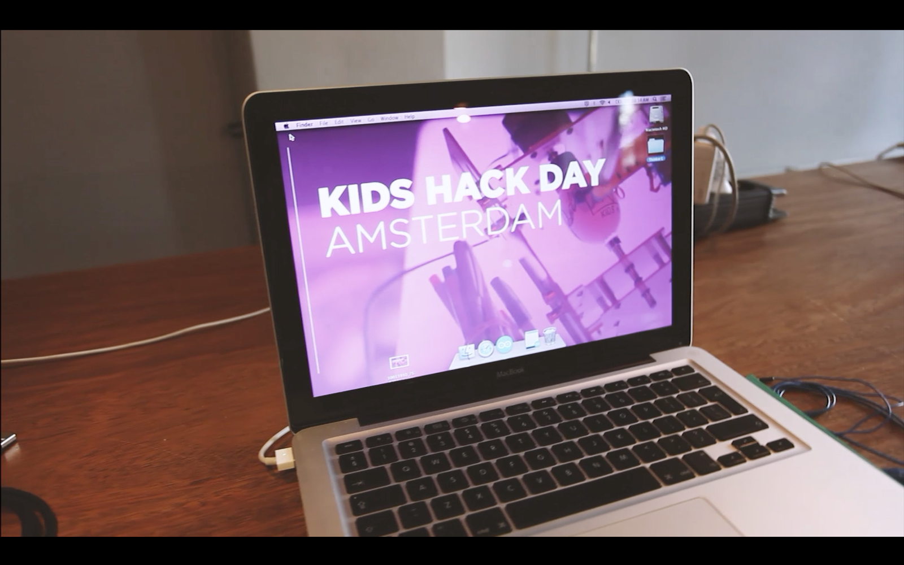
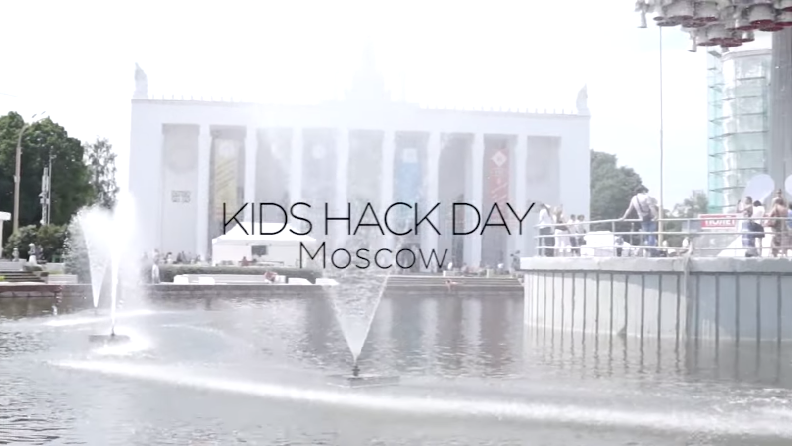
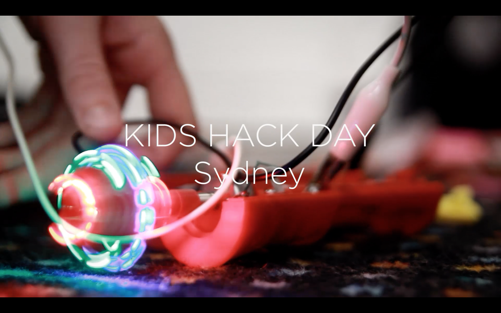

# Kids Hack Day Wiki

What is a Kids Hack Day

How to organize a Kids Hack Day in your city

Kids Hack Day is an entirely free-to-attend and volunteer-organized event, created by and for the community.

1. Assemble your co-organizing team.

This could be a couple friends, or a number of people who represent different communities in your area (e.g. a hacker, a maker, an artist, an education enthusiast). When you begin planning, make sure to delegate different tasks to different people so that each person can help make progress along the way. Be sure to add your city and contact details to the Kids Hack Day wiki.

2. Lock down a venue and a date.

This is the most vital step into making your event happen. Once you have a venue and a date, it’s easier to find sponsors, get plans in place, keep helpers motivated and iron out the logistics. Remember that you’re looking for a venue that is willing to donate their space for free (in exchange for top sponsorship). I’ve found that offices you or your friends work at are typically the best places to begin asking around – they’re usually shut down on weekends, they already have chairs/wifi, and are happy to welcome events that value collaboration between different types of people.

3. Find sponsors.

Ideally you’ve given yourself a few months before the event is set to take place. Once you’ve secured your venue/date, the immediate next step is to begin reaching out to potential sponsors. I recommend putting together a prospectus (I can customize one of these for you, if you need it). Ask companies, non-profits, startups, etc. in your area if they’re interested in helping support this volunteer-run, free-to-attend event. Don’t be nervous and don’t worry if you get rejected a few times – some companies are setup to regularly give away sponsorship and others are not. Enlist the help of your friends to get the word out about your event needing sponsorship.

4. Organize your budget and logistics.

Science Hack Day is a free-to-attend event. Science Hack Day typically provides 2 breakfasts, 2 lunches and 1 dinner to attendees free-of-charge. Look at the amount of sponsorship you’re bringing in and begin getting quotes on food so that you can set a budget. You’ll ideally want a bit of leftover money for any additional needs (office supplies, renting tables, silly prizes, etc.). Next, begin laying out the schedule for the event (including your set-up & clean-up time). Here’s an example schedule. Identify who you’d like to invite as lightning talk speakers. Science Hack Day is about doing, not talking, so lightning talks should be very quick! 5-10 minutes per talk. Ideally, you’ll have the lightning talks in separate rooms so that people who want to begin hacking right away don’t have to wait. Lightning talks should be about resources attendees can use for their hacks (space data, arduinos, oceanography robots, design tools, etc.). The main purpose of lightning talks is to provide a diverse range of subject areas for attendees to explore. You’ll also want to identify 3-5 judges to award medals/trophies to winning teams in different categories (Best In Show, Best Design, Best Hardware, Best Use of Data, People’s Choice Award). You can purchase affordable engraved science medals from Trophies Plus.

5. Open up registration.

I personally recommend using Eventbrite. You should ask attendees to register to attend, but remember to keep the event free (i.e. don’t charge money for tickets). As part of the registration process, ask your attendees to identify who they are – ‘artists/designers’, ‘scientists/researchers’, ‘developers/technologists’, or ‘just someone awesome’. This will help you keep track of the diversity of your event as people begin to sign up and point to what communities you need to be doing more outreach to. The next point is a really important one: ALWAYS double-book the number of tickets. Free events typically get around 50% turn-out, even if everyone is dying to go. If you want 50 people at your event, sign up 100 tickets. We recently signed up 400(!) people for the SF event and got a grand total of 217 people. Be sure to email the attendees at least 2 times before the event giving them all the details they need to know and encouraging them to begin brainstorming. Bonus points: Before/during registration, curate a list of super awesome and DIVERSE people you’d love to attend your event and send them personal invitations – this is the best way to create a diverse event (e.g. if you’re worried about the event being male-dominated, send personal invitations to a long list of women). Personal invitations are always appreciated and help others know that their unique background is valued at the event.

Any questions about specifics?

Feel free to send me (Juan Calderón) an email: juan@kidshackday.com

[Help](README.md)
